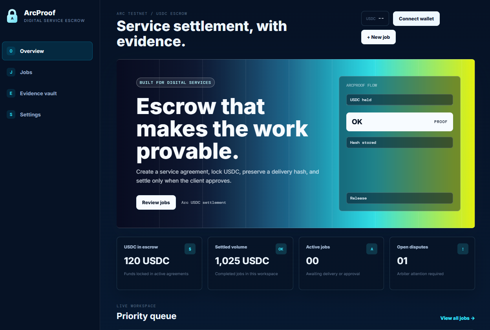
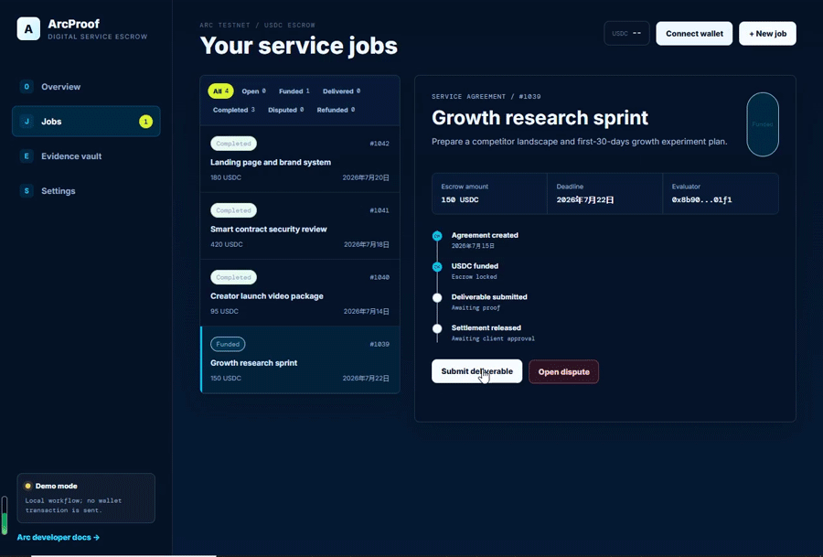

# ArcProof

## Digital service delivery escrow, settled in USDC on Arc.

ArcProof is a polished frontend and Solidity prototype for digital-service escrow. It gives a client, a provider, and an arbiter a clear lifecycle for remote work payments:

```text
Create agreement -> approve USDC -> fund escrow -> submit delivery proof -> approve or dispute -> release, refund, or split USDC
```

It is designed for small remote service jobs such as development fixes, design work, audits, content tasks, and AI-assisted services where both sides need a clearer payment agreement before work starts.

> Safety status: testnet prototype. Not audited. Do not use with real funds.
>
> ArcProof is an independent demo project built on Arc Testnet. It is not an official Arc product and is not affiliated with or endorsed by Arc.

## Live demo

- Frontend: https://arcproof-neon.vercel.app/
- Contract: https://testnet.arcscan.app/address/0x891B9413608EA09EeD17a98ac88D2A6e2EB5b70a
- Verified source: https://testnet.arcscan.app/address/0x891B9413608EA09EeD17a98ac88D2A6e2EB5b70a?tab=contract





## What is included

- React + TypeScript + Vite dashboard.
- Arc Testnet wallet connection and network switching.
- Demo mode that works without a deployed contract.
- Live mode using a deployed `ArcProofEscrow` contract.
- USDC approval and escrow funding flow.
- Delivery proof hashing with `keccak256`.
- Client or evaluator approval flow.
- Dispute state with arbiter-controlled split settlement.
- Expired funded jobs can be refunded by the client.
- ArcScan transaction and contract links.
- Foundry deployment script and contract tests.

## Problem

Remote digital work still has a basic trust problem.

Clients do not want to pay before they see the promised work. Freelancers, developers, designers, and AI service providers do not want to deliver work and then chase payment. Centralized marketplaces reduce this risk, but they also add custody, platform rules, delays, and fees.

ArcProof explores a lighter settlement layer for these jobs. The payment is locked in USDC before work starts, delivery evidence can be recorded, and release, refund, or dispute outcomes are handled by a verified smart contract instead of depending fully on a centralized platform.

## Workflow and permissions

```text
Open       - Client creates the agreement
Funded     - Client approves and locks USDC in escrow
Delivered  - Provider submits a delivery reference hash
Completed  - Client or evaluator approves and provider receives USDC
Disputed   - Client or provider opens a dispute
Refunded   - Client receives funds back after expiry or arbiter decision
```

Roles:

- Client: creates a job, funds escrow, approves delivery, opens disputes, or refunds expired funded jobs.
- Provider: receives payment after approval and submits the delivery proof reference.
- Evaluator: optional reviewer who can approve delivery on behalf of the client.
- Arbiter: resolves disputes with full release, full refund, or a percentage split.

The contract stores a delivery hash or reference, not private files. Evidence can point to a URL, repository commit, IPFS CID, or another content-addressed record.

## Why Arc

ArcProof is built around USDC settlement, not as an added checkout option.

Digital service work is often priced in dollars and happens across borders. USDC makes the payment amount easy to understand, while Arc gives the workflow an EVM environment where wallet approval, escrow funding, settlement, and ArcScan verification can be shown in one flow.

The same pattern can also fit future AI service markets. A human client, team, or AI agent can lock a clear budget, submit or verify delivery evidence, and settle only when the work reaches the agreed state.

## Smart contract summary

Contract: `ArcProofEscrow.sol`

Main functions:

```text
createJob()
fundJob()
submitDeliverable()
completeJob()
openDispute()
resolveDispute()
refundExpired()
getJob()
```

Security notes:

- The contract uses a simple non-reentrancy guard on functions that transfer USDC.
- Solidity `0.8.24` provides checked arithmetic by default.
- Funds move only through the configured USDC ERC-20 interface.
- The provider and evaluator are fixed per job.
- The arbiter is fixed at deployment.
- This is still a prototype and has not been audited.

## Deployment and verification

ArcProofEscrow is deployed and verified on Arc Testnet.

- RPC URL: https://rpc.testnet.arc.network
- Chain ID: `5042002`
- USDC interface: `0x3600000000000000000000000000000000000000`
- Escrow contract: https://testnet.arcscan.app/address/0x891B9413608EA09EeD17a98ac88D2A6e2EB5b70a
- Verified source: https://testnet.arcscan.app/address/0x891B9413608EA09EeD17a98ac88D2A6e2EB5b70a?tab=contract

Verification metadata:

```text
Contract: ArcProofEscrow
Compiler: Solidity 0.8.24
License: MIT
Optimizer: enabled, 200 runs
Constructor usdc_: 0x3600000000000000000000000000000000000000
Constructor arbiter_: 0xB3b5FF0BB23C4eD84f36D2bA7F3EAA7a86ab3c5E
```

## Run locally

```bash
npm install
cp .env.example .env
npm run dev
```

Open the local address printed by Vite, usually:

```text
http://127.0.0.1:5173
```

Without `VITE_ARCPROOF_ESCROW_ADDRESS`, the application operates in demo mode. It stores workflow data in the browser's local storage and does not send wallet transactions.

To run live mode locally or on Vercel:

```env
VITE_ARCPROOF_ESCROW_ADDRESS=0x891B9413608EA09EeD17a98ac88D2A6e2EB5b70a
```

## Frontend deployment

Vercel settings:

```text
Framework preset: Vite
Build command: npm run build
Output directory: dist
Node version: 20.19 or newer
```

Netlify settings:

```text
Build command: npm run build
Publish directory: dist
Node version: 20.19 or newer
```

## Contract development

```bash
cd contracts
forge install foundry-rs/forge-std --commit
forge test
```

Deploy to Arc Testnet:

```bash
cp .env.example .env
# Fill PRIVATE_KEY with a dedicated testnet wallet
forge script script/DeployArcProof.s.sol:DeployArcProof \
  --rpc-url arc_testnet \
  --broadcast
```

The included tests cover the happy-path escrow lifecycle, dispute split settlement, expired refund, and an unauthorized release attempt.

## Project structure

```text
arcproof/
+-- contracts/
|   +-- src/ArcProofEscrow.sol
|   +-- script/DeployArcProof.s.sol
|   +-- test/ArcProofEscrow.t.sol
+-- deployments/
+-- docs/
+-- src/
|   +-- App.tsx
|   +-- lib/arc.ts
|   +-- lib/abi.ts
|   +-- lib/demo.ts
+-- README.md
```

## Current status

- Frontend is deployed on Vercel.
- Live mode is connected to a verified Arc Testnet escrow contract.
- The frontend reads the real on-chain `jobId` from the `JobCreated` event.
- Contract includes escrow, delivery proof, release, dispute split, and expired refund flows.
- Foundry tests are included and passing locally.

## Possible next steps

- Add IPFS or encrypted evidence upload.
- Add milestone-based escrow.
- Add provider profiles and reputation.
- Explore multi-arbiter or optimistic dispute resolution.
